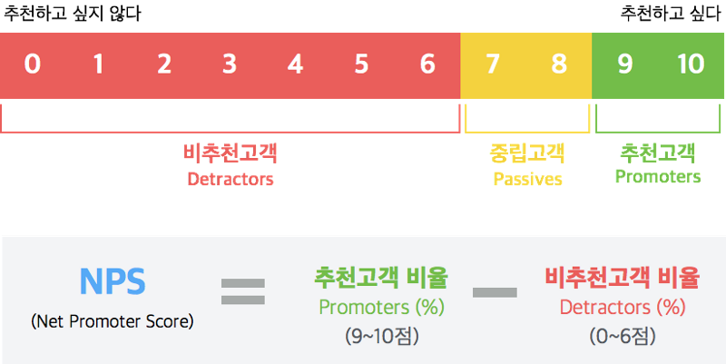

# Client-Facing Skills

* [102 Behavioral Interview Questions and Answers](https://www.cleverism.com/102-behavioral-interview-questions-including-answers/)

### What features make customers happy?

**Accessibility**
Customers should be able to find and access our products and services efficiently on their preferred channel. 

**Quality**
Quality is 

**Navigation**
Customers should be able to find and access our products and services efficiently. 

Search and Filter function is good solution that unsure shoppers can identify suitable products quickly. 

**Page Load Speed**
The faster your website loads, the happier your visitors.

* 1 second of load lag time would cost Amazon $1.6 billion (16억달러, billion = 10억)
* A lag time of 400ms results in a decrease of 0.44% traffic. 
  In real terms this amounts to 440 million abandoned sessions per month and a massive loss in advertising revenue for Google

**Language**
More than 50% of consumers won't make a purchase if information about a product isn't available in their language. 

**Personalized**
By personalizing the experience and sharing the right content, at the right time with the right people,  you can make interactions faster, easier and more efficient for your customers. 

This results in increased customer satisfaction and the likelihood of repeat visits. 

**Real-Time**
Real-time interactinos are becoming increasingly important to the modern consumer. They expect real-time responses and faster resolutions.  For instance, chatbots have emerged as a highly popular marketing solution for companies that want to provide their customers immediate access to information. 

**Deliverability**
According to an [Econsultacy report](https://econsultancy.com/free-shipping-and-delivery-timing-are-key-for-customer-satisfaction/), 48% of customers are not willing to wait more than five days for most of their purchases, while 23% said they would be willing to wait eight days or more. 
Shipping time does not only influence decisions but also has a major impact on customer satisfaction. 

**NPS (Net Promoter Score 순수 고객 추천 지수)**
NPS measures customer experience and it can be used as KPI (Ker Performance Indicator 핵심성과지표).

1. Customer satisfaction survey does not relate to the actual performance of **`customer retention rate`**  because respondents tend to give a relatively `good score`
2. According to the Harvard Business Review, NPS is actually proportional to the company's three year growth rate. 
3. NPS is simple and easy to use

* Measures NPS by 11 points (0~10 points) and calculate NPS by subtracting `detractors` from `promoters`
* `How likely isit that you would recommend the product or brand to a friend or colleague` is the question. 
* Theoretically the range of the score can be from -100 to +100. 
* At least [250 customers](https://medium.com/jandi-messenger-stories/nps-2-%EC%B5%9C%EC%86%8C%ED%95%9C%EC%9D%98-%EC%9E%90%EC%9B%90%EC%9C%BC%EB%A1%9C-nps%EB%A5%BC-%EC%8B%A4%ED%96%89%ED%95%B4%EB%B3%B4%EC%9E%90-d0c8e4e905b1) should respond

